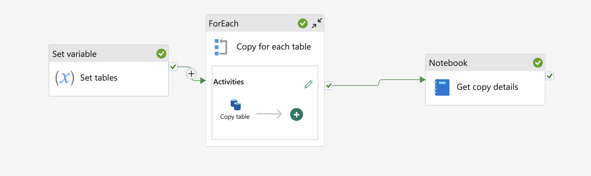

Sometimes you need a quick overview of pipeline run statistics: how long activities are running, the amount of data being copied, activity success or failure, and any error messages. Visualizing this data over time in a dashboard can be particularly useful.

## The Copy Data case
Let's focus on a scenario where we perform a Copy Data activity in a "for each" loop within a metadata-driven pipeline. Instead of capturing the statistics of the copy job in each iteration of the loop, we gather all the data at once after the entire loop has finished.




To capture this data, we'll use a Python notebook with the [semantic-link](https://learn.microsoft.com/en-us/python/api/semantic-link-sempy/sempy.fabric?view=semantic-link-python) package to query the **Fabric REST API**. Running this code in a Fabric Python notebook eliminates the need for a Spark session and explicit authentication.

## Step by step

### 1. Lookup pipeline runs

First, we need to look up the pipeline runs for a given pipeline:

```python
client = fabric.FabricRestClient()
pipeline_name = "copytablepipeline"

workspace_id = fabric.get_workspace_id()
pipeline_id = fabric.resolve_item_id(pipeline_name, type="Pipeline")

resp = client.request("GET", f"https://api.fabric.microsoft.com/v1/workspaces/{workspace_id}/items/{pipeline_id}/jobs/instances")

```

This will return the latest runs. We are taking the top run here (which means the pipeline which is still running), assuming the *GET* request has returned correctly.

```python
if resp.status_code == 200 and "value" in resp.json():
    pipeline_execution_id = resp.json()['value'][0]["id"]
```

### 2. Collect activities

Next, we collect the activities that have executed in this pipeline run within a specified time frame:

```python
current_time = datetime.now()
updated_after = current_time - timedelta(hours=4)
updated_before = current_time + timedelta(hours=4)

payload = {"lastUpdatedAfter": updated_after.strftime("%Y-%m-%dT%H:%M:%SZ"),"lastUpdatedBefore": updated_before.strftime("%Y-%m-%dT%H:%M:%SZ")}

activities = client.request("POST", f"https://api.fabric.microsoft.com/v1/workspaces/{workspace_id}/datapipelines/pipelineruns/{pipeline_execution_id}/queryactivityruns", json=payload)
```

### 3. Filter activites

We are interested in only the **Copy data** activities, so we filter the results accordingly:

```python
if resp.status_code == 200 and "value" in activities.json():
    copy_table_executions = [act for act in activities.json()["value"] if act["activityType"] == "Copy"]
```

These will contain the information about the activity. Here is an example value:

```json
{
   "pipelineId":"",
   "pipelineRunId":"",
   "activityName":"Copy table",
   "activityType":"Copy",
   "activityRunId":"",
   "status":"Succeeded",
   "activityRunStart":"2025-07-03T18:26:17.3338455Z",
   "activityRunEnd":"2025-07-03T18:26:45.6858078Z",
   "durationInMs":28351,
   "input":{
      "source":{
         "type":"LakehouseTableSource",
         "datasetSettings":{
            "annotations":[
               
            ],
            "linkedService":{
               "name":"name",
               "properties":{
                  "annotations":[
                     
                  ],
                  "type":"Lakehouse",
                  "typeProperties":{
                     "workspaceId":"",
                     "artifactId":"",
                     "rootFolder":"Tables"
                  }
               }
            },
            "type":"LakehouseTable",
            "schema":[
               
            ],
            "typeProperties":{
               "table":"sample"
            }
         }
      },
      "sink":{
         "type":"AvroSink",
         "storeSettings":{
            "type":"LakehouseWriteSettings"
         },
         "formatSettings":{
            "type":"AvroWriteSettings"
         },
         "datasetSettings":{
            "annotations":[
               
            ],
            "linkedService":{
               "name":"name",
               "properties":{
                  "annotations":[
                     
                  ],
                  "type":"Lakehouse",
                  "typeProperties":{
                     "workspaceId":"",
                     "artifactId":"",
                     "rootFolder":"Files"
                  }
               }
            },
            "type":"Avro",
            "typeProperties":{
               "location":{
                  "type":"LakehouseLocation",
                  "fileName":"sample2",
                  "folderPath":"avro"
               }
            },
            "schema":{
               
            }
         }
      },
      "enableStaging":false,
      "translator":{
         "type":"TabularTranslator",
         "typeConversion":true,
         "typeConversionSettings":{
            "allowDataTruncation":true,
            "treatBooleanAsNumber":false
         }
      }
   },
   "output":{
      "dataRead":3872,
      "dataWritten":1496,
      "filesRead":1,
      "filesWritten":1,
      "sourcePeakConnections":3,
      "sinkPeakConnections":1,
      "rowsRead":20,
      "rowsCopied":20,
      "copyDuration":25,
      "throughput":0.258,
      "errors":[
         
      ],
      "effectiveIntegrationRuntime":"WorkspaceIR (West Europe)",
      "usedDataIntegrationUnits":4,
      "billingReference":{
         "activityType":"DataMovement",
         "billableDuration":[
            {
               "meterType":"AzureIR",
               "duration":0.06666666666666667,
               "unit":"DIUHours"
            }
         ],
         "totalBillableDuration":[
            {
               "meterType":"AzureIR",
               "duration":0.06666666666666667,
               "unit":"DIUHours"
            }
         ]
      },
      "usedParallelCopies":1,
      "executionDetails":[
         {
            "source":{
               "type":"Lakehouse"
            },
            "sink":{
               "type":"Lakehouse"
            },
            "status":"Succeeded",
            "start":"2025-07-03T18:26:18.4886133Z",
            "duration":25,
            "usedDataIntegrationUnits":4,
            "usedParallelCopies":1,
            "profile":{
               "queue":{
                  "status":"Completed",
                  "duration":9
               },
               "transfer":{
                  "status":"Completed",
                  "duration":15,
                  "details":{
                     "listingSource":{
                        "type":"Lakehouse",
                        "workingDuration":0
                     },
                     "readingFromSource":{
                        "type":"Lakehouse",
                        "workingDuration":0
                     },
                     "writingToSink":{
                        "type":"Lakehouse",
                        "workingDuration":0
                     }
                  }
               }
            },
            "detailedDurations":{
               "queuingDuration":9,
               "transferDuration":15
            }
         }
      ],
      "dataConsistencyVerification":{
         "VerificationResult":"NotVerified"
      },
      "durationInQueue":{
         "integrationRuntimeQueue":0
      }
   },
   "iterationHash":"",
   "userProperties":{
      
   },
   "error":{
      "errorCode":"",
      "message":"",
      "failureType":"",
      "target":"Copy table",
      "details":""
   },
   "retryAttempt":"None",
   "recoveryStatus":"None",
   "integrationRuntimeNames":[
      "workspaceir"
   ],
   "executionDetails":{
      "integrationRuntime":[
         {
            "name":"WorkspaceIR",
            "type":"Managed",
            "location":"West Europe",
            "nodes":"None"
         }
      ]
   }
}

```

### 4. Do something with the data

```python
for ex in copy_table_executions:
    print(f"status: {ex['status']}")
    print(f"Run time: {round(ex['durationInMs'] / 1000)}s")
    print(f"Files written: {ex['output']['filesWritten']}")
    print(f"Data read: {ex['output']['dataRead']}")
```

### 5. (Optional) Take pagination into account

When dealing with a large number of activities in your pipeline, the response from the API might be paginated. This means that the data is split across multiple responses, and you need to make several requests to retrieve all the data. You can check if the response is paginated by looking at the continuationToken in the response.

The JSON response of the POST request typically contains two keys. The command:

```python
activities.json().keys()
```

will return something like `dict_keys(['value', 'continuationToken'])`.

If there is no more data to retrieve, the continuationToken will be empty. If pagination is present, we need to keep sending requests until an empty token is encountered. For all requests other than the first, we need to include the continuationToken in the payload.

Here is a code snippet to handle pagination:

```python
copy_table_executions = []
continuation_token = None

while True:
    if continuation_token:
        payload["continuationToken"] = continuation_token
    
    activities = client.request("POST", f"https://api.fabric.microsoft.com/v1/workspaces/{workspace_id}/datapipelines/pipelineruns/{pipeline_execution_id}/queryactivityruns", json=payload)
    data = activities.json()

    if resp.status_code == 200 and "value" in data:
        copy_table_executions.extend([act for act in data["value"] if act["activityType"] == "Copy"])
        continuation_token = data.get("continuationToken")
    else:
        print("No activity executions found for this run")
        notebookutils.notebook.exit()

    if not continuation_token:
        break
```

These steps will help you capture and analyze the details of your pipeline runs. You can save this information in your lakehouse, in a file for later display, or use it in any other way that suits your needs.
Full code is provided in [this gist](https://gist.github.com/ThibauldC/e4239b55944fe8d12de5de433504ea75).
