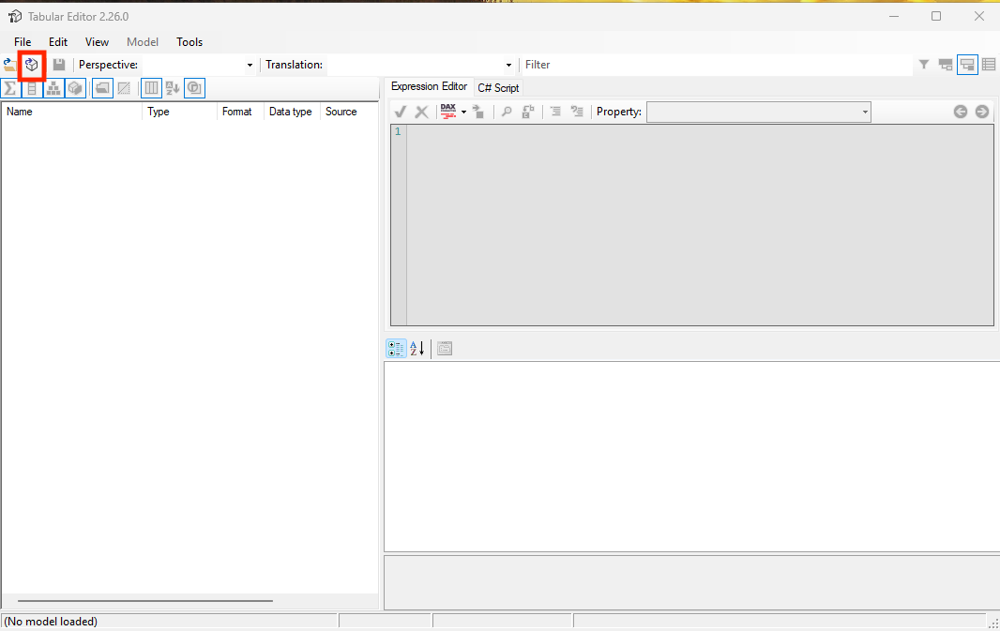

Sometimes you have created a Direct Lake model on Microsoft Fabric which is already pretty detailed with lots of tables and relationships. You have also maybe already built reports on top of this Direct Lake model. Instead of manually recreating the semantic model in Import mode and rebinding the reports to the new model you can do it (semi-)programmatically.

## Fabric Semantic Model storage modes
Before diving in, let’s briefly look at the storage modes available in Microsoft Fabric semantic models:
- Import
- DirectQuery
- Direct Lake
    - Direct Lake on OneLake
    - Direct Lake on SQL endpoints

We won’t go into the details of each mode or when to use which one -- **Marco Russo** has already done a great job covering that in [this blog post](https://www.sqlbi.com/blog/marco/2025/05/13/direct-lake-vs-import-vs-direct-lakeimport-fabric-semantic-models-may-2025/).

## Direct Lake model to Import mode

Yes, you can recreate the model manually in Power BI, but if you'd rather **convert it in one go**, Tabular Editor is your friend.

### Connecting to the model using Tabular editor

Open Tabular Editor and connect to your Fabric model via the **XMLA endpoint**:




#### Finding the XMLA endpoint

in your Fabric workspace, go to:

*Fabric Workspace Settings > License Info > Connection link*. It should look like this: `Data Source=powerbi://api.powerbi.com/v1.0/myorg/your_workspace_name`.

#### Example Connection String (via Service Principal)

If you're using Tabular Editor 2 and authenticating via a service principal, use this format:

`Data Source=powerbi://api.powerbi.com/v1.0/myorg/your_workspace_name;Initial Catalog=lakehouse_name;User ID=app:client_id@tenant_id;Password=secret_value`

Ensure your service principal has the necessary workspace permissions.

### Run the conversion script

Daniel Otykier (author of Tabular Editor) shared a [great LinkedIn post](https://www.linkedin.com/pulse/converting-direct-lake-model-import-daniel-otykier-h2chf) where he explains how to use a **C# script** in Tabular Editor to convert a Direct Lake model to Import mode.


> **Note**: Once the script runs, publish the converted model. You can't overwrite it in-place. Also, ensure valid credentials are set for refreshing the Import model.

## Rebinding the reports to the new model

Converting the model is just one part. Reports built on the original Direct Lake model must be rebound to the new Import model. This too can be done programmatically using **PowerShell**, the **Power BI REST API*** and a service principal following these steps:

### Get the Service Principal Client Secret from Azure Key Vault

```powershell
Connect-AzAccount -TenantId $tenantId
$clientSecret = (Get-AzKeyVaultSecret -VaultName $vaultName -Name $secretName).SecretValue
```

### Get token with Service Principal to log in to Power BI API

```powershell
$tokenResponse = Get-MsalToken `
    -ClientId $clientId `
    -TenantId $tenantId `
    -ClientSecret $clientSecret `
    -Scopes "https://analysis.windows.net/powerbi/api/.default" `
    -Authority "https://login.microsoftonline.com/$tenantId"

$authHeader = @{
    Authorization = "Bearer $($tokenResponse.AccessToken)"
}
```

### Rebind reports to the new Import mode model

Loop through the reports in your workspace and rebind any that use the old dataset:

```powershell
$reports = Invoke-RestMethod -Uri "https://api.powerbi.com/v1.0/myorg/groups/$workspaceId/reports" `
    -Headers $authHeader -Method Get

foreach ($report in $reports.value) {
    $reportId = $report.id
    $reportName = $report.name
    $datasetId = $report.datasetId

    if ($datasetId -eq $oldDatasetId) {
        Write-Host "Rebinding report '$reportName' ($reportId)..."
        $body = @{
            datasetId = $newDatasetId
        } | ConvertTo-Json

        Invoke-RestMethod -Uri "https://api.powerbi.com/v1.0/myorg/groups/$workspaceId/reports/$reportId/Rebind" `
            -Headers $authHeader -Method Post -Body $body -ContentType "application/json"

        Write-Host "Rebound report '$reportName' to new dataset."
    } else {
        Write-Host "Skipping report '$reportName' (bound to different dataset)."
    }
}
```

## Wrapping up
With a bit of scripting and the right tools (Tabular Editor, PowerShell, and Power BI API), you can automate the process of converting a Direct Lake model to Import mode and rebind reports to the new dataset—saving you tons of manual effort. Full code can be found in [this GitHub gist](https://gist.github.com/ThibauldC/f22907ca6da5939f7af7050ec1511c5b).
